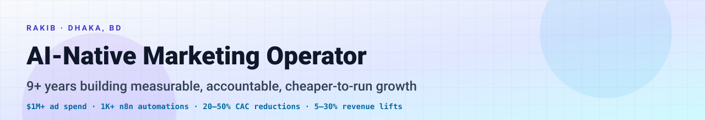

<!--
  Hello, recruiter / founder / CMO 👋
  Everything on this page is sourced from the public Upwork profile and
  this GitHub account. Every claim carries a number; every CTA links to
  a public destination. If something feels off, ping me on Upwork.
-->

<picture>
  <source media="(prefers-color-scheme: dark)" srcset="./assets/banner.svg">
  
</picture>

 

# Hi, I'm **Rakib** 👋

### I help CEOs, CMOs, and founders turn marketing into a **measurable, accountable, cheaper-to-run** system — not a creative guessing game.

 

  

📍 <b>Dhaka, Bangladesh</b> &nbsp;·&nbsp;
🌐 <b>EN</b> (Native / Bilingual) &nbsp;·&nbsp;
♟️ Internationally rated <b>FIDE</b> chess player

 

## 📈 What the last 9+ years shipped

<i>Results listed on my Upwork profile. Numbers are mine, not estimates.</i>

<table>
  <thead>
    <tr>
      <th align="left">Brand</th>
      <th align="right">Result</th>
    </tr>
  </thead>
  <tbody>
    <tr><td><b>Praava Health</b></td><td align="right"><b>BDT 6.67M</b> MRR</td></tr>
    <tr><td><b>ASUS Zenfone</b></td><td align="right"><b>1.3M</b> views</td></tr>
    <tr><td><b>IFAD Autos</b></td><td align="right"><b>150+</b> commercial vehicles sold</td></tr>
    <tr><td><b>Pickaboo</b></td><td align="right"><b>20,000+</b> phones sold</td></tr>
    <tr><td><b>DBL Ceramics</b></td><td align="right"><b>1M+</b> sq ft of tiles sold</td></tr>
    <tr><td><b>GAIN</b></td><td align="right"><b>1.02M+</b> pledges</td></tr>
    <tr><td><b>TECNO Mobile</b></td><td align="right"><b>300%</b> search volume lift in 3 days</td></tr>
    <tr><td><b>TECNO Mobile</b></td><td align="right"><b>1M+</b> views on a short film</td></tr>
    <tr><td><b>Concord Real Estate</b></td><td align="right"><b>1,000+</b> qualified leads</td></tr>
    <tr><td><b>Anglo Eastern Glass</b></td><td align="right"><b>117,000 m³</b> sold</td></tr>
    <tr><td><b>MACES</b></td><td align="right"><b>1,700+</b> footfall to education fair</td></tr>
  </tbody>
</table>

 

## 🛠️ How I work with you

<table>
  <thead>
    <tr>
      <th align="left">Engagement</th>
      <th align="left">What you walk away with</th>
    </tr>
  </thead>
  <tbody>
    <tr>
      <td><b>Performance Marketing &amp; Media Buying</b> Meta · Google · TikTok · LinkedIn · Programmatic · Retargeting · App-install</td>
      <td>20–50% CAC reductions and 5–30% revenue lifts. Disciplined buying on the channels your customers actually live on — not the trendiest one.</td>
    </tr>
    <tr>
      <td><b>Marketing Operations &amp; Attribution</b> GA4 · CleverTap · Sheets · SyncWith</td>
      <td>Honest attribution, dashboards that show where every dollar goes and what it returns, and CPAs / CPLs benchmarks your whole team can hold itself to.</td>
    </tr>
    <tr>
      <td><b>Automation &amp; AI Workflows</b> n8n · Zapier · Claude Code · OpenAI Codex · Generative AI</td>
      <td>1,000+ n8n automations shipped to date. Lead routing, creative testing, reporting pipelines, AI-assisted research and ops — engineered to free your team for the work only humans can do.</td>
    </tr>
    <tr>
      <td><b>Funnel &amp; Landing-Page Build</b> ClickFunnels · Shopify · WordPress · Mailchimp · AWeber</td>
      <td>Conversion-driven landing pages, lead-gen and retargeting flows, and lifecycle messaging — wired end-to-end so attribution actually closes.</td>
    </tr>
  </tbody>
</table>

 

## 🏢 Selected brands

  
  
  
  
  
  
  
  
  
  
  
  
  
  
  
  
  
  

 

## 🧰 Stack I work in

<table>
  <tr>
    <td valign="top" width="50%">

**Ads &amp; Media**

`Meta Ads` · `Google Ads` · `Google Ad Manager` · `TikTok Ads` · `LinkedIn Campaign Manager` · `Programmatic Display` · `Affiliates` · `Retargeting` · `App-install`

</td>
    <td valign="top" width="50%">

**Analytics, SEO &amp; Tracking**

`Google Analytics` · `CleverTap` · `SEMrush` · `Ahrefs` · `Ubersuggest`

</td>
  </tr>
  <tr>
    <td valign="top">

**Automation &amp; AI**

`n8n` · `Zapier` · `Claude Code` · `OpenAI Codex` · `Generative AI`

</td>
    <td valign="top">

**CRM, Pages &amp; Lifecycle**

`ClickFunnels` · `Shopify` · `WordPress` · `Mailchimp` · `AWeber` · `Cold Email`

</td>
  </tr>
  <tr>
    <td valign="top" colspan="2">

**Data &amp; Ops**

`Google Sheets` · `SyncWith` · `ClickUp` · `Notion` · `Trello`

</td>
  </tr>
</table>

 

## 🪜 Where I've been

| When | Role | Where |
|---|---|---|
| **Apr 2025 → Present** | Head of Department, **Global Marketing** | **TCL Global** — 35-member team, 21 branches, 14+ countries |
| **Nov 2023 → Mar 2025** | Head of Department, Digital Marketing | **LaserTreat** — 12-member team, $45–50K/mo ad spend |
| **Mar 2022 → Oct 2023** | Senior Manager, Digital Marketing | **Praava Health** — 30-member marketing + 9-member telemarketing team |

 

## 🏗️ Currently building

<picture>
  <source media="(prefers-color-scheme: dark)" srcset="./assets/phiora-card.svg">
  
</picture>

 

---

## 🤝 Let's talk

If your CAC is creeping up, your attribution is fuzzy, your team is buried in manual work, or growth has plateaued — I can help.

The fastest path is a **scoped engagement on Upwork**: clear deliverable, milestones, and a single owner.

  

<b><a href="https://www.upwork.com/freelancers/~01ef8c393a849e8bb8">upwork.com/freelancers/~01ef8c393a849e8bb8</a></b>

 

&nbsp;

 

📌 Last updated 2026 · <i>Helping CXOs with Systems, AI, and Marketing</i> · <i>Currently building PhiOra</i>